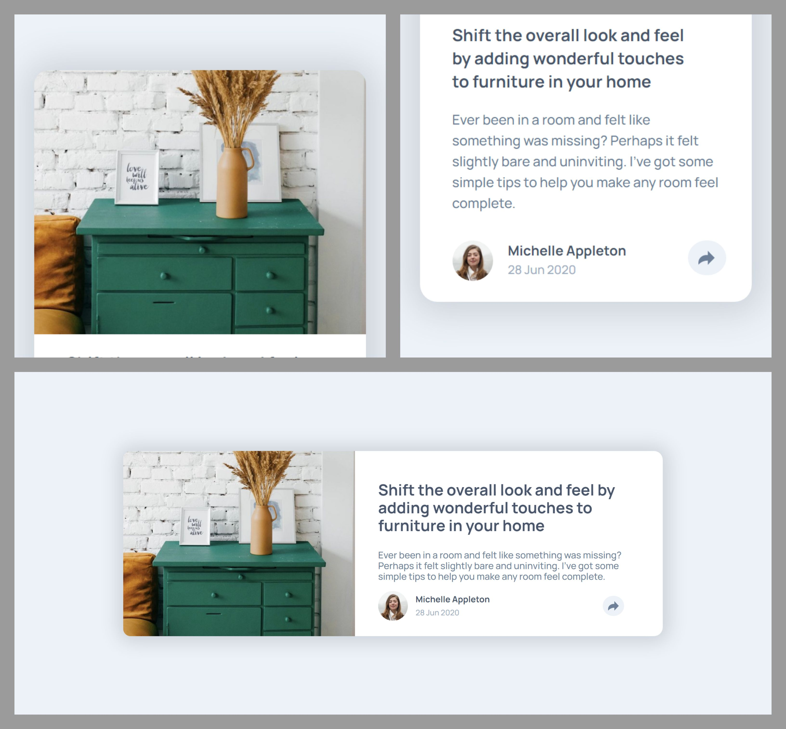
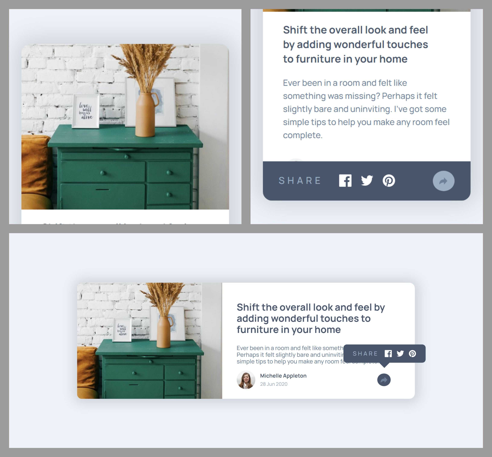

# Frontend Mentor - Article preview component solution

This is a solution to the [Article preview component challenge on Frontend Mentor](https://www.frontendmentor.io/challenges/article-preview-component-dYBN_pYFT).

## Table of contents

- [Overview](#overview)
  - [The challenge](#the-challenge)
  - [Screenshot](#screenshot)
  - [Links](#links)
- [My process](#my-process)
  - [Built with](#built-with)
  - [What I learned](#what-i-learned)
  - [Continued development](#continued-development)
  - [Useful resources](#useful-resources)
- [Author](#author)

## Overview

### The challenge

Users should be able to:

- View the optimal layout for the component depending on their device's screen size
- See the social media share links when they click the share icon

### Screenshot

#### Desktop - Mobile

#### Stats active

### Links

- Solution URL: [This is the solution as seen from Frontend Mentor]() Coming soon.
- Live Site URL: [Live solution]().

## My process

### Built with

- Semantic HTML5 markup
- CSS custom properties
- Flexbox
- Desktop-first workflow
- Transitions
- Accessibility
- Media queries
- Pseudo-classes
- JavaScript vanilla
- [Google Fonts](https://fonts.google.com/)

### What I learned

I met a very useful new method called `toggle`, which allows to tell the name of a CSS class and if it is active or not.

### Continued development

I continue to improve my learning about DOM manipulation.

### Useful resources

- [Desarrollo Web 6](https://desarrolloweb.com/faq/como-anadir-y-quitar-una-clase-css-de-un-elemento-mediante-javascript) - It was on this site that I discovered the method I used for this project.
- [MDN web docs](https://developer.mozilla.org/en-US/docs/Web/API/DOMTokenList/toggle) - It helped me to better understand the toggle method.

## Author

- Codepen - [@boudgnosis](https://codepen.io/boudgnosis)
- Frontend Mentor - [@boudgnosis](https://www.frontendmentor.io/profile/boudgnosis)
- Twitter - [@juan_ariasd](https://twitter.com/juan_ariasd)
- Dev - [@juan_duque](https://dev.to/juan_duque)
- Linkedink - [juan pablo arias duque](https://www.linkedin.com/in/jpariasduque/)
